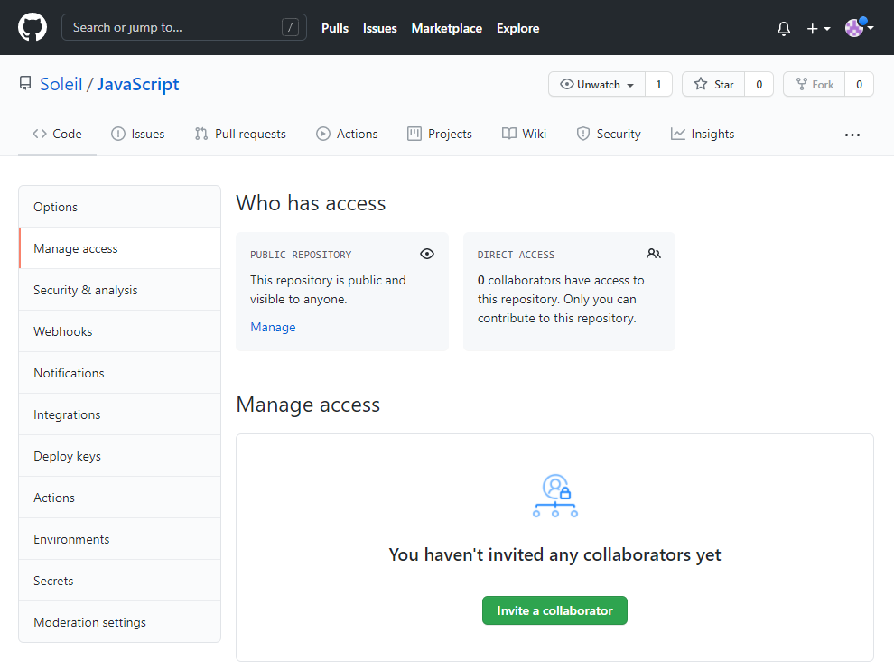
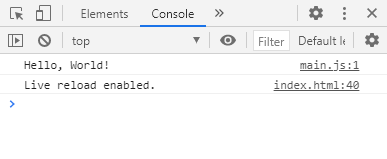

# #1 JavaScript 개요 강의 노트

## 웹 개발에 도움이 되는 사이트

---

1. Developer Roadmaps

   : Web 개발과 관련된 로드맵을 제공하는 사이트

   🔗[Developer Roadmaps](https://roadmap.sh/)

2. MDN(Reference)

   : HTML, CSS, JavaScript의 Reference를 제공하는 사이트

   🔗[MDN](https://developer.mozilla.org/)

3. Font Awesome

   : 무료 아이콘 제공 사이트. HTML 태그로 아이콘을 받아올 수 있다.

   🔗[Font Awesome](https://fontawesome.com/)

4. Oven

   : 다양한 디바이스에 맞는 웹 UI를 만들어 볼 수 있는 사이트

   🔗[Oven](https://ovenapp.io/)

## VSCode Application 단축키

---

1. Command Palette 열기

   : VSCode에서 실행 가능한 명령어를 키보드 만을 이용해 실행할 수 있다.

   ```
   Ctrl + Shift + P or F1
   ```

2. 파일 검색

   : 파일 이름의 일부만 타이핑하거나 포함된 글자를 입력해도 검색이 된다.

   ```
   Ctrl + P
   ```

3. Setting 열기

   : Setting을 열고 상단에 있는 📑와 비슷한 모양의 아이콘을 클릭하면 JSON 파일로 수동적으로 설정할 수 있다.

   ```
   Ctrl + ,
   ```

4. Explorer 창 닫기

   ```
   Ctrl + B
   ```

5. Terminal 창 열기

   ```
   Ctrl + `
   ```

6. 그 외 단축키

   ```
   Ctrl + K + S
   ```

## Code 단축키

---

1. 파일의 맨 앞/맨 끝 이동

   ```
   Ctrl + Home     : 맨 앞으로 이동
   Ctrl + End      : 맨 끝으로 이동
   ```

2. Line 이동 및 선택

   ```
   Home (+ Shift)  : 맨 앞으로 이동(선택)
   End (+ Shift)   : 맨 끝으로 이동(선택)
   ```

3. 단어 단위로 이동 및 선택

   ```
   Ctrl + 방향키(← / →)            : 이동
   Ctrl  + Shift + 방향키(← / →)   : 선택
   ```

4. line 단위로 이동 및 선택

   : 블럭 단위로도 이동 및 선택이 가능하다.

   ```
   Alt + 방향키(↑ / ↓)             : 이동
   Alt + Shift + 방향키(↑ / ↓)     : 선택
   ```

5. 코드 중간에서 다음 줄로 넘어가기

   ```
   Ctrl + Enter
   ```

6. 단어 다중 선택

   : 선택하고 싶은 개수만큼 단축키를 눌러주면 커서가 뜬다.

   ```
   Ctrl + D
   ```

7. 이전의 커서 위치로 이동

   ```
   Ctrl + U
   ```

8. 커서 다중 선택

   : 선택하고자 하는 부분이 같은 열이 아닐 때 사용하면 좋다.

   ```
   Alt + Click
   ```

9. Column 다중 선택

   : 선택하고자 하는 부분이 같은 열일 때 사용하면 좋다.

   ```
   Alt + Shift + drag mouse
   / 블럭 선택 후 Shift + Alt + I
   / Ctrl + Alt + 방향키(↑ / ↓)
   ```

## 유용한 Extension

---

1. Material Theme

   : VSCode 테마를 바꿀 수 있는 Extension

2. Material Icon Theme

   : 파일 아이콘의 테마를 바꿀 수 있는 Extension

3. Prettier - Code formatter

   : 코드 포맷팅을 할 수 있는 Extension. 설정 창에서 사용자의 취향에 맞게 옵션을 설정할 수 있다.

4. Bracket Pair Colorizer

   : 괄호의 색깔을 다르게 해서 코드의 가독성을 높여주는 Extension

5. Indent-rainbow

   : 들여쓰기된 부분을 rainbow 색으로 하이라이팅해서 코드의 가독성을 높여주는 Extension

6. Auto Rename Tag

   : HTML에서 앞에 있는 태그를 바꾸면 뒤에 있는 태그를 자동으로 바꿔주는 Extension

7. ESLint

   : JavaScript의 문법을 검사하는 Extension

8. CSS Peek

   : HTML에서 Ctrl을 누른 상태로 클릭하면 정의된 CSS 파일로 이동하게 해주는 Extension

9. Live Server

   : HTML, CSS, JavaScript 파일 수정 시 VSCode에서 저장만 하면 브라우저에서 바로 반영해서 실행해주는 Extension

   → Command Palette를 실행해서 Live Server를 검색해서 실행하면 된다.

## VSCode와 Github 연동하기

---

1. Github에 연동할 폴더를 우클릭한 후 `Code(으)로 열기`를 클릭한다.
2. `Ctrl + N`, `Ctrl + S`로 파일을 생성한다.
3. Source Control 아이콘을 누르거나 Ctrl + Shift + G를 눌러서 `Source Control`을 실행한다.
4. `initialize` 버튼을 누르거나 `git init` 명령어를 입력한다.
5. Source Control 아이콘에 숫자가 뜨는 지 확인하거나 Changes에 파일이 뜨는 지 확인하고 상단의 `체크 버튼`을 눌러 `commit`한다.
6. 상단에 뜨는 입력 창에 `commit message`를 입력하면 commit이 완료된다.
7. Github에서 `repository`를 생성한다.
8. code 메뉴에서 뜨는 명령어를 한 줄씩 `Terminal 창`에 붙여넣기 한다.
   ```
   git remote add origin <git 주소>
   git branch -M main
   git push -u origin main
   ```
9. push를 완료한 후 Github를 새로고침하면 commit한 파일을 확인할 수 있다.
10. 파일을 수정하면 다시 Source Control에 수정한 파일이 뜬다.
11. 이때 Changes에 있는 파일의 `+` 버튼을 누르면 Stage로 업데이트 된다.
12. Stage에 있는 파일을 `더블 클릭`하면 수정 전후를 비교할 수 있다.
13. 수정한 파일을 다시 commit하면 VSCode창 하단에 🔄 모양으로 생긴 아이콘 옆에 (숫자)↑가 뜨는데 그 아이콘을 누르면 `push`가 된다.

## repository에 collaborator 추가하기

---

repository **Settings** > **Manage access** > **invite a collaborator**



## 콘솔창에 Hello World 출력하기

---

<소스 코드>

```js
console.log("Hello, World!");
```

<실행 화면>

</img>
