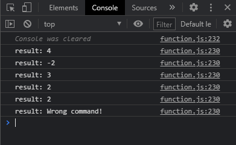

# 2주차 HOMEWORK

4/2(금)까지 본인 github에 업로드

```js
// function calculate(command, a, b)
// -> 함수 선언 다양하게 연습하기
// command : add(+), substract(-), multiply(*), divide(/), remainder(%)
// divide -> 0에 대한 처리 필수

calculate("add", 1, 3);
calculate("-", 1, 3);
calculate("multiply", 1, 3);
calculate("/", 4, 2);
calculate("%", 5, 3);
calculate("]", 1, 3);
```

<실행 결과>

</img>
